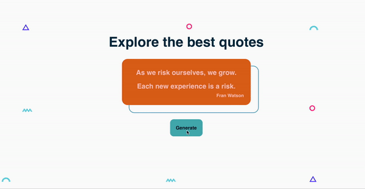
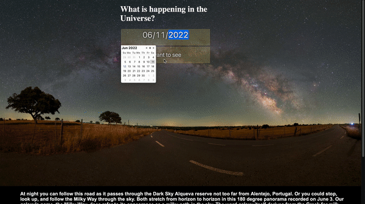
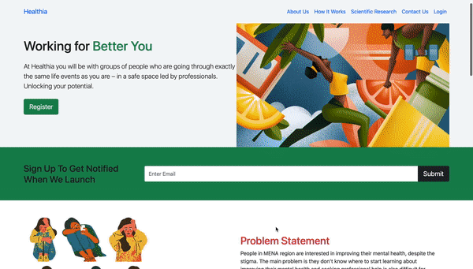

<h3 align="left">Software Engineer at @100Devs</h3>

- 🌱 I’m currently learning **JavaScript, React, Solidity**

- 📫 How to reach me **regina.zhyldyzbekova@gmail.com**

<!-- PROJECTS -->
<h1 align="center">Projects</h1>
<table>
  
  <tr>
    <td width="50%" valign="top">
      <h3 align="center">Quootes</h3>
         
        
         
        

          
    
  
      

        
<strong>Java Script, React, HTML, CSS</strong> -Quotes often open the eyes and the mind to understand truths and acknowledge things you otherwise would have missed. Reading quotes can improve how you feel and change your mood for the better. 

    </td>
    <td width="50%" valign="top">
      <h3 align="center">NASA</h3>
         
      
         
        

          
  
  
      

        
<strong>Javascript, HTML, CSS </strong> - Explore the universe 

    </td>
  </tr>
  
  <tr>
    <td width="50%" valign="top">
      <h3 align="center">Adventure</h3>
       
        
       
        

  
  
      

        
<strong>HTML5, CSS3, & Javascript</strong> - A simple information-based travel website for people who love exploring places.

    </td>
    <td width="50%" valign="top">
      <h3 align="center">Healthia</h3>
         
        
         
        

          
  
  
      

        
<strong>HTML5, & Javascript</strong> - Healthia makes mental health service accessible and affordable to everyone. At Healthia, you'll connect to a group of people in a safe space to get and give support!

    </td>
  </tr>
</table>

<h3 align="left">Connect with me:</h3>

     

<h3 align="left">Languages and Tools:</h3>

       

